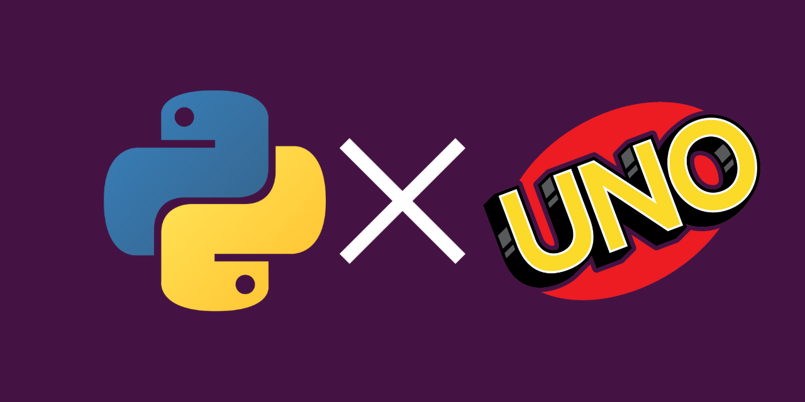

# UNO

Questo è repository del **Gruppo 7** al corso di laurea triennale di Ingegneria biomedica Unipd
Abbiamo sviluppato il gioco di carte **UNO** con il linguaggio di programmazione **Python**

# TEAM

- Mirafiori Elia
- Zuanazzi Arianna
- Dell'Aquila Ilaria
- Gasparini Anna

## ISTRUZIONI

Per far funzionare il gioco da riga di comando clonare il repository e avviare il gioco dal Main.py.

I file contenuti nella cartella **GraphicAttempt** sono parte del progetto per la versione grafica di UNO,
purtroppo non siamo riusciti a completare la versione grafica di questo gioco tramite la librerira PyGame.

Da tenere comunque in considerazione il tentativo nello sviluppo di una versione grafica del gioco.
